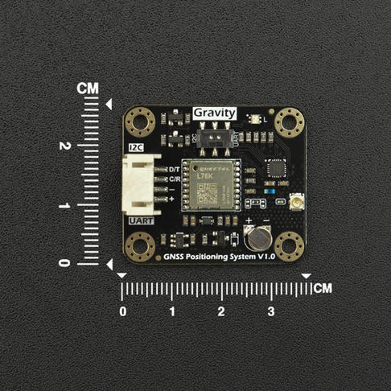

# DFRobot_3DFace
- [English Version](./README.md)

这是一款内置自研嵌入式系统3D深度还原算法、3D人脸识别算法及多模态活体防范算法,能够有效保障用户信息及解锁安全性，在99%通过率的前提下，能够做到低于百万分之一的误识率。同时使用多模态活体防伪算法，能有效屏蔽照片、视频及各种头模和假人的攻击。



## 产品链接(https://www.dfrobot.com.cn/goods-3115.html)

    SKU：SEN0609   SEN0610

## 目录

* [概述](#概述)
* [库安装](#库安装)
* [方法](#方法)
* [兼容性](#兼容性)
* [历史](#历史)
* [创作者](#创作者)

## 概述

提供一个python库给模块，此库具有以下功能：
  获取 物体是否存在
  获取 物体的速度，范围，物体能量强度

## 库安装
1. 下载库至树莓派，要使用这个库，首先要将库下载到Raspberry Pi，命令下载方法如下:

```
sudo git clone https://github.com/DFRobot/DFRobot_3DFace
```

1. 打开并运行例程，要执行一个例程demo_x.py，请在命令行中输入python demo_x.py。例如，要执行 get_mm wavewave.py例程，你需要输入:

```
python  motion_range_velocity.py
或 
python2 motion_range_velocity.py
或 
python3 motion_range_velocity.py
```

## 方法

```python
  def begin(self):
    '''!
      @brief begin
      @return True 
    '''

  def set_standby(self):
    '''!
      @brief 设置为待机模式，此模式下才正常驱动模块
      @return True or False
    '''

  def delete_face_id(self, number):
    '''!
      @brief 删除 指定的人脸id
      @param number
      @return True or False
    '''

  def delete_all_face_id(self):
    '''!
      @brief 删除所有的人脸信息
      @return True or False
    '''
    
  def direct_registration(self, name="", timerout=0x0a):
    '''!
      @brief 直视注册
      @param name 此函数不使用
      @param timerout
      @return struct_face_reg 注册的结果
    '''

  def look_up_registration(self, name="", timerout=0x0a):
    '''!
      @brief 向上看注册人脸
      @param name 此函数不使用
      @param timerout
      @return struct_face_reg 注册的结果
    '''
  
  def look_down_registration(self, name="", timerout=0x0a):
    '''!
      @brief 向下看注册人脸
      @param name 此函数不使用
      @param timerout
      @return struct_face_reg 注册的结果
    '''

  def turn_left_registration(self, name="", timerout=0x0a):
    '''!
      @brief 向左看注册人脸
      @param name 此函数不使用
      @param timerout
      @return struct_face_reg 注册的结果
    '''

  def turn_right_registration(self, name="", timerout=0x0a):
    '''!
      @brief 向右看注册人脸
      @param name 注册人脸的名字
      @param timerout
      @return struct_face_reg 注册的结果
    '''

  def face_registration(self, name, mode=ADMIN, direction=DIRECT_VIEW, reg_type=ONE_REG ,repetition=1 ,timerout=0X0A):
    '''!
      @brief 单项注册人脸
      @param mode = 管理员
      @param direction = 直视注册
      @param reg_type = 单项注册
      @param repetition = 重复注册
      @param name 注册的名字
      @param timerout
      @return struct_face_reg 注册的结果
    '''

  def face_matching(self):
    '''!
      @brief 人脸匹配
      @return match 匹配的结果
    '''

  def get_face_message(self):
    '''!
      @brief 获取人脸的信息
      @return struct_result_data 人脸id ,获取结果
    '''
```

## 兼容性

* RaspberryPi Version

| Board        | 正常运行  | 运行失败   | 未测试    | 备注
| ------------ | :-------: | :--------: | :------: | :-----: |
| RaspberryPi2 |           |            |    √     |         |
| RaspberryPi3 |           |            |    √     |         |
| RaspberryPi4 |     √     |            |          |         |

* Python版本

| Python  | 正常运行  | 运行失败   | 未测试    | 备注
| ------- | :-------: | :--------: | :------: | :-----: |
| Python2 |     √     |            |          |         |
| Python3 |     √     |            |          |         |


## 历史

- 2024/02/26 - V1.0.0 版本

## 创作者

Written by ZhixinLiu(zhixin.liu@dfrobot.com), 2022. (Welcome to our website)